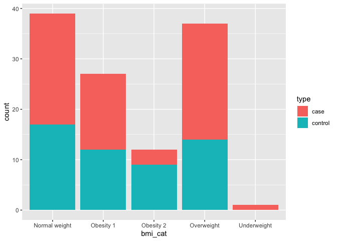

Pre Class Assessment
================
Holly Finertie
1/17/2020

``` r
library(tidyverse)
```

    ## ── Attaching packages ──────────────────────────────── tidyverse 1.2.1 ──

    ## ✔ ggplot2 3.2.1     ✔ purrr   0.3.2
    ## ✔ tibble  2.1.3     ✔ dplyr   0.8.3
    ## ✔ tidyr   1.0.0     ✔ stringr 1.4.0
    ## ✔ readr   1.3.1     ✔ forcats 0.4.0

    ## ── Conflicts ─────────────────────────────────── tidyverse_conflicts() ──
    ## ✖ dplyr::filter() masks stats::filter()
    ## ✖ dplyr::lag()    masks stats::lag()

``` r
library(ggplot2)
```

Read in data files

``` r
data = read_csv("./data/data.csv") %>% 
  janitor::clean_names()
```

    ## Parsed with column specification:
    ## cols(
    ##   Age = col_double(),
    ##   BMI = col_double(),
    ##   Glucose = col_double(),
    ##   Insulin = col_double(),
    ##   HOMA = col_double(),
    ##   Leptin = col_double(),
    ##   Adiponectin = col_double(),
    ##   Resistin = col_double(),
    ##   MCP.1 = col_double(),
    ##   Classification = col_double()
    ## )

Problem 1:

``` r
summary(data) 
```

    ##       age            bmi           glucose          insulin      
    ##  Min.   :24.0   Min.   :18.37   Min.   : 60.00   Min.   : 2.432  
    ##  1st Qu.:45.0   1st Qu.:22.97   1st Qu.: 85.75   1st Qu.: 4.359  
    ##  Median :56.0   Median :27.66   Median : 92.00   Median : 5.925  
    ##  Mean   :57.3   Mean   :27.58   Mean   : 97.79   Mean   :10.012  
    ##  3rd Qu.:71.0   3rd Qu.:31.24   3rd Qu.:102.00   3rd Qu.:11.189  
    ##  Max.   :89.0   Max.   :38.58   Max.   :201.00   Max.   :58.460  
    ##       homa             leptin        adiponectin        resistin     
    ##  Min.   : 0.4674   Min.   : 4.311   Min.   : 1.656   Min.   : 3.210  
    ##  1st Qu.: 0.9180   1st Qu.:12.314   1st Qu.: 5.474   1st Qu.: 6.882  
    ##  Median : 1.3809   Median :20.271   Median : 8.353   Median :10.828  
    ##  Mean   : 2.6950   Mean   :26.615   Mean   :10.181   Mean   :14.726  
    ##  3rd Qu.: 2.8578   3rd Qu.:37.378   3rd Qu.:11.816   3rd Qu.:17.755  
    ##  Max.   :25.0503   Max.   :90.280   Max.   :38.040   Max.   :82.100  
    ##      mcp_1         classification 
    ##  Min.   :  45.84   Min.   :1.000  
    ##  1st Qu.: 269.98   1st Qu.:1.000  
    ##  Median : 471.32   Median :2.000  
    ##  Mean   : 534.65   Mean   :1.552  
    ##  3rd Qu.: 700.09   3rd Qu.:2.000  
    ##  Max.   :1698.44   Max.   :2.000

Problem 2:

``` r
data_bmi = data %>% 
  mutate(bmi_cat = case_when(
      bmi <= 16.4 ~ "Severely underweight", 
      bmi >= 16.5 & bmi <= 18.4 ~ "Underweight",
      bmi >=18.5 & bmi <= 24.9 ~ "Normal weight",
      bmi >= 25 & bmi <= 29.9 ~ "Overweight", 
      bmi >= 30 & bmi <= 34.9 ~ "Obesity 1", 
      bmi >= 35 & bmi <= 39.9 ~ "Obesity 2", 
      bmi >= 40 ~ "Obesity 3"
    )
  )
```

Problem 3:

``` r
data_final = data_bmi %>% 
  mutate(
    type = recode(classification, 
      `1` = "control", 
      `2` = "case"), 
    outcome = recode(type, 
      "control" = 0, 
      "case" = 1))
    

plot = data_final %>% 
  ggplot(aes(x = bmi_cat, fill = type)) +
  geom_bar(stat = "count")

plot
```

<!-- -->

Problem 4:

``` r
logit_reg = 
  glm(outcome ~ glucose + homa + leptin + bmi + age, 
      family = binomial(link = "logit"), data = data_final) %>% 
  broom::tidy()

logit_reg
```

    ## # A tibble: 6 x 5
    ##   term        estimate std.error statistic  p.value
    ##   <chr>          <dbl>     <dbl>     <dbl>    <dbl>
    ## 1 (Intercept) -3.63       2.36      -1.54  0.124   
    ## 2 glucose      0.0817     0.0235     3.47  0.000515
    ## 3 homa         0.274      0.172      1.59  0.111   
    ## 4 leptin      -0.00857    0.0158    -0.543 0.587   
    ## 5 bmi         -0.104      0.0566    -1.84  0.0657  
    ## 6 age         -0.0229     0.0144    -1.59  0.111

Problem 5:

``` r
linear_reg = 
  lm(insulin ~ bmi + age + glucose, data = data_final) %>% 
  broom::tidy()

linear_reg
```

    ## # A tibble: 4 x 5
    ##   term        estimate std.error statistic      p.value
    ##   <chr>          <dbl>     <dbl>     <dbl>        <dbl>
    ## 1 (Intercept) -13.5       5.86      -2.30  0.0231      
    ## 2 bmi           0.150     0.164      0.914 0.363       
    ## 3 age          -0.0540    0.0519    -1.04  0.301       
    ## 4 glucose       0.230     0.0375     6.13  0.0000000137
