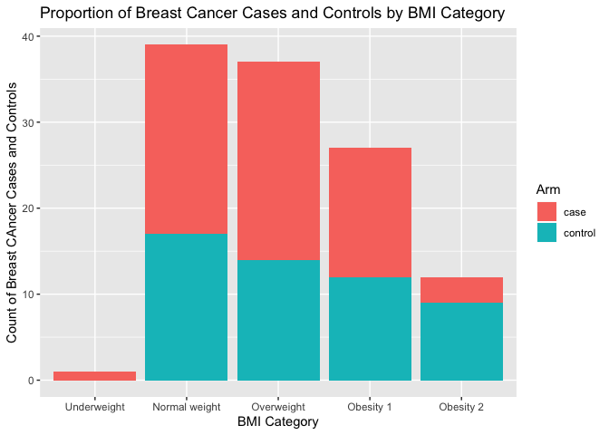

Assignment 1
================
Holly Finertie (HF2379)
1/17/2020

``` r
library(tidyverse)
```

    ## ── Attaching packages ────────────────────────────────────────────── tidyverse 1.2.1 ──

    ## ✔ ggplot2 3.2.1     ✔ purrr   0.3.2
    ## ✔ tibble  2.1.3     ✔ dplyr   0.8.3
    ## ✔ tidyr   1.0.0     ✔ stringr 1.4.0
    ## ✔ readr   1.3.1     ✔ forcats 0.4.0

    ## ── Conflicts ───────────────────────────────────────────────── tidyverse_conflicts() ──
    ## ✖ dplyr::filter() masks stats::filter()
    ## ✖ dplyr::lag()    masks stats::lag()

``` r
library(ggplot2)
```

## Problem 1:

Please find tables below that provide summaries (min, mean, median, IQR,
max) of the quantitative features of the dataset.

``` r
data = read_csv("./data/data.csv") %>% 
  janitor::clean_names()
```

    ## Parsed with column specification:
    ## cols(
    ##   Age = col_double(),
    ##   BMI = col_double(),
    ##   Glucose = col_double(),
    ##   Insulin = col_double(),
    ##   HOMA = col_double(),
    ##   Leptin = col_double(),
    ##   Adiponectin = col_double(),
    ##   Resistin = col_double(),
    ##   MCP.1 = col_double(),
    ##   Classification = col_double()
    ## )

``` r
summary(data) 
```

    ##       age            bmi           glucose          insulin      
    ##  Min.   :24.0   Min.   :18.37   Min.   : 60.00   Min.   : 2.432  
    ##  1st Qu.:45.0   1st Qu.:22.97   1st Qu.: 85.75   1st Qu.: 4.359  
    ##  Median :56.0   Median :27.66   Median : 92.00   Median : 5.925  
    ##  Mean   :57.3   Mean   :27.58   Mean   : 97.79   Mean   :10.012  
    ##  3rd Qu.:71.0   3rd Qu.:31.24   3rd Qu.:102.00   3rd Qu.:11.189  
    ##  Max.   :89.0   Max.   :38.58   Max.   :201.00   Max.   :58.460  
    ##       homa             leptin        adiponectin        resistin     
    ##  Min.   : 0.4674   Min.   : 4.311   Min.   : 1.656   Min.   : 3.210  
    ##  1st Qu.: 0.9180   1st Qu.:12.314   1st Qu.: 5.474   1st Qu.: 6.882  
    ##  Median : 1.3809   Median :20.271   Median : 8.353   Median :10.828  
    ##  Mean   : 2.6950   Mean   :26.615   Mean   :10.181   Mean   :14.726  
    ##  3rd Qu.: 2.8578   3rd Qu.:37.378   3rd Qu.:11.816   3rd Qu.:17.755  
    ##  Max.   :25.0503   Max.   :90.280   Max.   :38.040   Max.   :82.100  
    ##      mcp_1         classification 
    ##  Min.   :  45.84   Min.   :1.000  
    ##  1st Qu.: 269.98   1st Qu.:1.000  
    ##  Median : 471.32   Median :2.000  
    ##  Mean   : 534.65   Mean   :1.552  
    ##  3rd Qu.: 700.09   3rd Qu.:2.000  
    ##  Max.   :1698.44   Max.   :2.000

## Problem 2:

Using code below, the continuous BMI variable was transformed into a
categorical variable (bmi\_cat) with the following BMI categories:

  - Severely underweight: BMI \< 16.5kg/m^2
  - Underweight: 16.5 \<= BMI \<= 18.5 kg/m^2
  - Normal weight: 18.5 \<= BMI \<=24.9 kg/m^2
  - Overweight: 25 \<= BMI \<= 29.9 kg/m^2
  - Obesity class I: 30 \<= BMI \<= 34.9 kg/m^2
  - Obesity class II: 35 \<= BMI \<= 39.9 kg/m^2
  - Obesity class III: BMI \>= 40 kg/m^2

<!-- end list -->

``` r
data_bmi = data %>% 
  mutate(bmi_cat = case_when(
      bmi <= 16.4 ~ "Severely underweight", 
      bmi >= 16.5 & bmi <= 18.4 ~ "Underweight",
      bmi >=18.5 & bmi <= 24.9 ~ "Normal weight",
      bmi >= 25 & bmi <= 29.9 ~ "Overweight", 
      bmi >= 30 & bmi <= 34.9 ~ "Obesity 1", 
      bmi >= 35 & bmi <= 39.9 ~ "Obesity 2", 
      bmi >= 40 ~ "Obesity 3"
    )
  )
```

## Problem 3:

``` r
data_final = data_bmi %>% 
  mutate(
    Arm = recode(classification, 
      `1` = "control", 
      `2` = "case"), 
    outcome = recode(Arm, 
      "control" = 0, 
      "case" = 1))
    

plot = data_final %>% 
  ggplot(aes(x = bmi_cat, fill = Arm)) +
  geom_bar(stat = "count") + 
  xlab("BMI Category") +
  ylab("Count of Breast CAncer Cases and Controls") +
  labs(
    title = "Proportion of Breast Cancer Cases and Controls by BMI Category"
  )

plot
```

<!-- -->

## Problem 4:

Construct a logistic regression model using breast cancer classification
as the outcome and glucose, HOMA, leptin, BMI (continuous) and age as
the independent variables. Fill in the beta estimate and 95% confidence
interval associated with a 1-unit change in HOMA

``` r
logit_reg_CI = 
  glm(outcome ~ glucose + homa + leptin + bmi + age, 
      family = binomial(link = "logit"), data = data_final) %>% 
  confint.default() %>% 
  knitr::kable()

head(logit_reg_CI)
```

    ## [1] "                    2.5 %      97.5 %"
    ## [2] "------------  -----------  ----------"
    ## [3] "(Intercept)    -8.2421263   0.9899967"
    ## [4] "glucose         0.0355895   0.1278079"
    ## [5] "homa           -0.0631845   0.6109489"
    ## [6] "leptin         -0.0395085   0.0223609"

``` r
logit_reg_betas = 
  glm(outcome ~ glucose + homa + leptin + bmi + age, 
      family = binomial(link = "logit"), data = data_final) %>% 
  broom::tidy() %>% 
  knitr::kable()


logit_reg_betas
```

| term        |    estimate | std.error |   statistic |   p.value |
| :---------- | ----------: | --------: | ----------: | --------: |
| (Intercept) | \-3.6260648 | 2.3551767 | \-1.5396148 | 0.1236543 |
| glucose     |   0.0816987 | 0.0235255 |   3.4727682 | 0.0005151 |
| homa        |   0.2738822 | 0.1719759 |   1.5925611 | 0.1112587 |
| leptin      | \-0.0085738 | 0.0157833 | \-0.5432196 | 0.5869786 |
| bmi         | \-0.1042605 | 0.0566423 | \-1.8406817 | 0.0656682 |
| age         | \-0.0228810 | 0.0143769 | \-1.5915055 | 0.1114959 |

``` r
logit_reg_CI
```

|             |       2.5 % |    97.5 % |
| ----------- | ----------: | --------: |
| (Intercept) | \-8.2421263 | 0.9899967 |
| glucose     |   0.0355895 | 0.1278079 |
| homa        | \-0.0631845 | 0.6109489 |
| leptin      | \-0.0395085 | 0.0223609 |
| bmi         | \-0.2152775 | 0.0067564 |
| age         | \-0.0510592 | 0.0052973 |

As seen in the table above, the beta estimate associated with a 1-unit
change in HOMA is 0.274 with 95% CI(-0.063, 0.611).

## Problem 5:

``` r
linear_reg_betas = 
  lm(insulin ~ bmi + age + glucose, data = data_final) %>% 
  broom::tidy() %>% 
  knitr::kable()

linear_reg_CI = 
  lm(insulin ~ bmi + age + glucose, data = data_final)  %>% 
  confint.default() %>% 
  knitr::kable()

linear_reg_betas
```

| term        |     estimate | std.error |   statistic |   p.value |
| :---------- | -----------: | --------: | ----------: | --------: |
| (Intercept) | \-13.4957592 | 5.8594131 | \-2.3032612 | 0.0231101 |
| bmi         |    0.1496903 | 0.1638181 |   0.9137594 | 0.3628062 |
| age         |  \-0.0540217 | 0.0519390 | \-1.0400988 | 0.3005341 |
| glucose     |    0.2298179 | 0.0375152 |   6.1259998 | 0.0000000 |

``` r
linear_reg_CI
```

|             |        2.5 % |      97.5 % |
| ----------- | -----------: | ----------: |
| (Intercept) | \-24.9799980 | \-2.0115205 |
| bmi         |  \-0.1713873 |   0.4707679 |
| age         |  \-0.1558202 |   0.0477769 |
| glucose     |    0.1562895 |   0.3033463 |

As seen in the table above, the beta estimate associated with a 1-unit
change in age is -0.054 with 95% CI(-0.156, 0.048).
